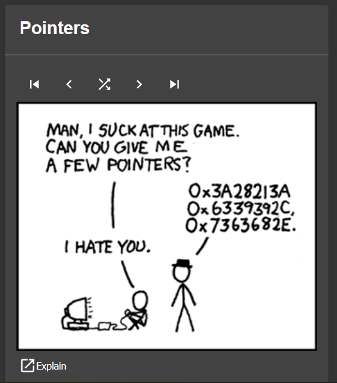

# Backstage xkcd plugin

Welcome to the xkcd plugin!


The Backstage `xkcd` plugin provides a simple way to display XKCD comics in your Backstage application, with an optional navigation bar to browse through past comics.



<!-- TOC -->
* [Backstage xkcd plugin](#backstage-xkcd-plugin)
  * [Installation](#installation)
  * [Integration](#integration)
  * [Configuration](#configuration)
  * [Contributing](#contributing)
    * [Development](#development)
  * [Future plans](#future-plans)
  * [License](#license)
<!-- TOC -->

## Installation
To install the plugin, you'll need to add it to your Backstage app's dependencies using either Yarn or NPM.

**Yarn**
```shell
yarn add --cwd packages/app backstage-plugin-xkcd
```

## Integration
Once you've installed the plugin, you'll need to integrate it into your Backstage app. To do so, you'll need to:

Add the XkcdComicCard component to a page in your app:

```typescript jsx
import { XkcdComicCard } from 'backstage-plugin-xkcd';
//....
const HomePage = () => (
    // ...
      <Grid item md={3} xs={6} style={{height: "500px"}}>
          <XkcdComicCard />
      </Grid>
    // ... 
);
```
Alternatively, this plugin also supports [customizable homepages](https://github.com/backstage/backstage/tree/master/plugins/home#customizable-home-page).
You simply add `<HomePageXkcdComic />` to the allowed plugins in section:
```tsx
import { HomePageXkcdComic } from 'backstage-plugin-xkcd';
//....

export const HomePage = () => {
  return (
    <CustomHomepageGrid>
      // Insert the allowed widgets inside the grid       
      // ...
        <HomePageXkcdComic />
    </CustomHomepageGrid>
  );
};
```
This feature requires `@backstage/plugin-home@^0.5.1` available.


You can also enable `/xkcd` route in `packages/app/src/App.tsx`
```typescript jsx
import { XkcdPage } from 'backstage-plugin-xkcd';
//....
const routes = (
    <FlatRoutes>
        // ...
        <Route path="/xkcd" element={<XkcdPage />} />
        // ...
    </FlatRoutes>
```

Set up a proxy for the XKCD API by adding the following configuration to your app-config.yaml file:
```yaml
proxy:
  '/xkcd-proxy':
    target: https://xkcd.com/
```

And that's it! The xkcd plugin should now be integrated into your Backstage app, and you should see the xkcd card when you navigate to the page where it's included.

## Configuration
By default, the plugin will display the most recent _xkcd_ comic. However, you can configure it to display a specific comic by passing in a `comicNumber` property to the `XkcdComicCard` component:
```typescript jsx
<XkcdComicCard comicNumber={1234} />
```
This will display the XKCD comic with the number 1234.

You can also configure the plugin to show or hide the navigation bar by passing in a `showNav` property:

```typescript jsx
<XkcdComicCard showNav={false} />
```
This will hide the navigation bar.

or the _Explain link_

```typescript jsx
<XkcdComicCard showExplain={false} />
```
This will hide the _Explain link_.

## Contributing
Don't hesitate to contribute to the plugin. This is my first TypeScript/React/Backstage product so please be gentle to me... 

### Development
The plugin is added to the example app in this repository, meaning you'll be able to access it by running `yarn start` in the root directory, and then navigating to [/xkcd](http://localhost:3000/xkcd).

You can also serve the plugin in isolation by running `yarn start` in the plugin directory.
This method of serving the plugin provides quicker iteration speed and a faster startup and hot reloads.
It is only meant for local development, and the setup for it can be found inside the [/dev](./dev) directory.


## Future plans
- More tests
- Support to show only specific xkcd images - by categories (programming...) 

## License
The Backstage XKCD plugin is licensed under the Apache 2.0 License.

